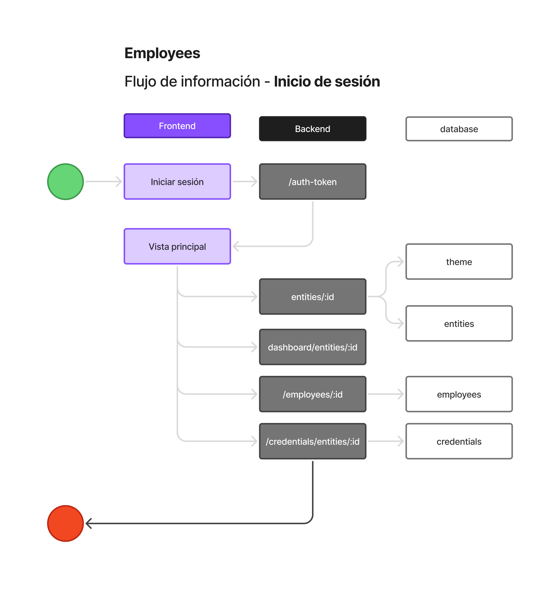
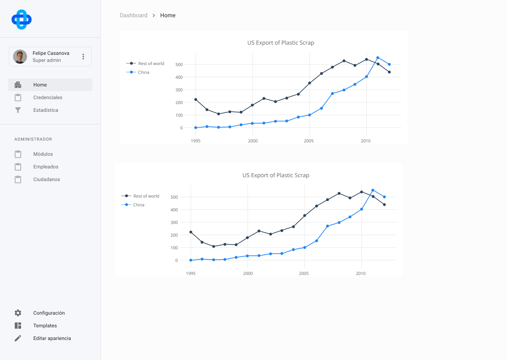
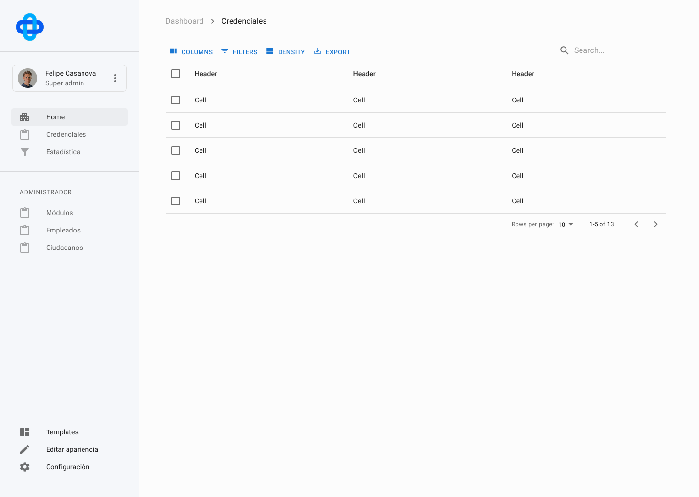

# Arquitectura - SOVRA

El presente documento detalla la arquitectura tecnológica de la aplicación *SOVRA*, cuyo objetivo principal es facilitar la emisión, gestión y verificación de credenciales digitales verificables utilizando el protocolo **QuarkID**.

Se divide en 3 secciones:

1. Contexto
2. Entidades
3. Arquitectura Frontend
    1. Estructura de carpetas
    2. Librerías a utilizar
    3. Autenticación
    4. Flujo de información
    5. Prototipo

## Contexto

Esta aplicación está diseñada para que instituciones públicas y privadas puedan emitir **credenciales digitales verificables** a ciudadanos o usuarios que las soliciten. Los **funcionarios autorizados** de cada institución serán responsables de gestionar todo el proceso de emisión, lo que incluye validar las solicitudes y **firmar digitalmente** los datos que conforman cada credencial.

De este modo, los ciudadanos o usuarios podrán **almacenar, presentar y gestionar sus credenciales de forma segura y privada**, sin depender de intermediarios ni requerir nuevas validaciones por parte de la entidad emisora cada vez que necesiten usar sus credenciales.

## Entidades

La plataforma contempla distintos actores clave con funciones específicas:

1. **Institución**
    - Entidad emisora de credenciales.
    - Administra a sus funcionarios y define los tipos de credenciales que puede emitir.
    - Supervisa las operaciones realizadas dentro de su organización.
2. **Funcionarios**
    - Usuarios designados por la institución para gestionar solicitudes.
    - Pueden crear, emitir, revocar o actualizar credenciales según las políticas establecidas.
    - Acceden al historial y estado de las credenciales emitidas.
3. **Ciudadanos / Usuarios**
    - Personas que solicitan y reciben credenciales digitales.
    - Pueden visualizar el estado de sus credenciales, almacenarlas en su billetera digital y presentarlas cuando sea necesario.
    - Tienen control total sobre sus credenciales y datos personales.
4. **Super Admin de Institución**
    - Usuario con privilegios globales sobre la plataforma.
    - Administra el sistema a nivel general, incluyendo la creación y configuración de nuevos funcionarios.

## Arquitectura Frontend

### Estructura de carpetas

La arquitectura se organiza en torno a módulos, donde cada módulo corresponde a una funcionalidad o dominio específico dentro de la aplicación. Esta estructura modular permite que cada parte de la aplicación sea autónoma y fácilmente extensible sin afectar el resto del sistema.

**Es importante mencionar que para utilizar este tipo de arquitectura se necesita conocer bien la lógica de negocio.** 

```
src/
├── assets/                 # Recursos estáticos como imágenes, íconos y fuentes
│
├── modules/                # Módulos funcionales del sistema

│   ├── core/               # Base común para toda la aplicación
│   │   ├── components/     # Ej: Layout.tsx, Navbar.tsx
│   │   ├── design-system/  # Ej: Button.tsx, Input.tsx, Modal.tsx
│   │   ├── hooks/          # Ej: useTheme.ts
│   │   ├── lib/            # Ej: i18n.ts, env.ts
│   │   ├── utils/          # Ej: formatDate.ts, downloadFile.ts
│   │   ├── store/          # Configuración del estado de Redux
│   │   │   ├── rootReducer.ts  # Combinación de reducers
│   │   │   └── store.ts        # Configuración del store
│   │   └── routes/         # Manejo de rutas privadas
│   │       └── PrivateRoute.tsx  # Componente para proteger rutas privadas
│
│   ├── entities/           # Institución emisora (pública o privada)
│   │   ├── components/     # Ej: InstitutionInfo.tsx, CredentialDashboard.tsx
│   │   ├── hooks/          # Ej: useInstitutionSettings.ts
│   │   ├── lib/            # Ej: institutionTypes.ts
│   │   ├── services/       # Ej: institution.service.ts
│   │   ├── states/         # Ej: institution.state.ts
│   │   └── utils/          # Ej: getInstitutionLogo.ts
│
│   ├── auth/               # Módulo de autenticación
│   │   ├── components/     # Ej: SignUpForm.tsx, LoginForm.tsx
│   │   ├── hooks/          # Ej: useAuth.ts
│   │   ├── lib/            # Ej: authConfig.ts
│   │   ├── services/       # Ej: auth.service.ts
│   │   ├── states/         # Ej: auth.state.ts
│   │   └── utils/          # Ej: parseJwt.ts
│
│   ├── employees/          # Gestión de funcionarios o empleados
│   │   ├── components/     # Ej: EmployeeList.tsx, EmployeeSummary.tsx
│   │   ├── hooks/          # Ej: useEmployees.ts, useUpdateEmployee.ts
│   │   ├── services/       # Ej: employee.service.ts
│   │   ├── states/         # Ej: employees.state.ts
│   │   └── utils/          # Ej: formatEmployeeName.ts
│
│   ├── citizens/           # Gestión de ciudadanos/usuarios finales
│   │   ├── components/     # Ej: ProfileCard.tsx, CredentialViewer.tsx
│   │   ├── hooks/          # Ej: useCitizenCredentials.ts
│   │   ├── services/       # Ej: citizen.service.ts
│   │   ├── states/         # Ej: citizen.state.ts
│   │   └── utils/          # Ej: normalizeCitizenData.ts
│
│   └── payments/           # Gestión de pagos y transacciones
│       ├── components/     # Ej: PaymentForm.tsx, ReceiptCard.tsx
│       ├── hooks/          # Ej: usePayments.ts, usePaymentMethods.ts
│       ├── services/       # Ej: payment.service.ts
│       ├── states/         # Ej: payment.state.ts
│       └── utils/          # Ej: formatCurrency.ts, getPaymentStatusColor.ts

```

### Librerías a utilizar

**Core del proyecto**

1. React (Vite)
2. Typescript
3. React Router DOM
4. Zod (validación de datos)
5. React Hook Form (Formularios)
6. Axios

**Manejos de estado y datos**

1. Redux Toolkit
2. RTK Query
3. MSW (Intercepta endpoint para trabajar sin un backend real)

**UI &. Estilos**

1. Material UI
2. Plotly (gráficos)

**Testing**

1. Vitest

**Linting / Formato**

1. Prettier + Eslint

### Autenticación

Todo depende del tipo de inicio de sesión que queramos implementar. Si no necesitamos autenticación con proveedores como Google o Microsoft, **JWT** es la mejor opción. En caso contrario, lo ideal sería usar **OAuth2**

### Flujo de información
Este flujo es un modelo diseñado para aplicarse después de conocer la estructura de la base de datos de la aplicación y definir los estados de Redux, así como la secuencia en que estos deben setearse.



### Prototipo Figma

Se propone abordar la etapa de prototipado para acelerar el desarrollo, organizando el trabajo en mini-sprints basados en las secciones diseñadas en Figma (por ejemplo, la sección del Navbar), y vinculándolos directamente con tareas gestionadas en Jira (por ejemplo, la creación del componente Navbar).

[Enlace Figma SOVRA V.0](https://www.figma.com/design/9NZtJxMuVFCncAjNNsdH23/SOVRA---V0?node-id=8604-8137&t=26MGeJn2zPCBUIxC-1)





### Tareas Jira

Las tareas del proyecto se gestionan en Jira, donde cada mini-sprint se traduce en tickets específicos alineados con el diseño en Figma. Esto permite un seguimiento claro del progreso y control de tiempos.

.png)
